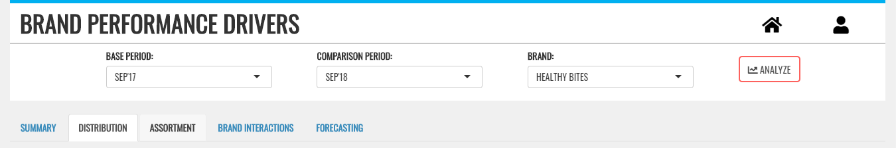

# Brand Performance Dashboard

This is an R Shiny dashboard for a company to track its brand performance.

The idea of this dashboard is to measure the perforamance of a brand between two time periods and analyze the difference from different lenses.

It includes five tabs. The first tab gives the summary of how the brand performance has changed between the two time periods. The remaining four tabs analyzes the performance from the perspective of:

- Distribution: How the change in reach of the brand to its consumers affected its performance
- Assortment: Which products of the brand are leading the brand growth/decline
- Brand Interactions: How is the brand performing vis-à-vis competition and which competition brand is it losing to/gain from the most
- Forecasting: How does the short-term outlook of the brand look like

The dashboard allows the user to select the time periods for comparison and the brand whose performance needs to be analyzed.




This dashboard can be accessed online [here](https://keyurshah1994.shinyapps.io/prod_performance_dashboard/).

In order to run this dashboard locally on your computer, run the following code in R:
```
# install.packages("shiny")
shiny::runGitHub("business-drivers-dashboard", "keyurbipinshah")
```